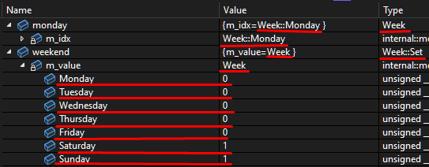

## Modern Enum
Modern Enum is an enum library intended as a replacement for C++ enum classes. </br>
It introduces two important features:
* **Reflection**: the program can access enum size and element names, enabling logging of useful debug messages and serialization.
* **Type-safe flags**: you can manipulate sets of flags in a robust, type-safe way, instead of casting to an unsigned integer.

Modern Enum aims to be efficient and easy to work with:
* **Easy to integrate**: drop-in header-only library.
* **Compile-time**: the library is 100% constexpr.
* **Ease of debug**: human-readable Visual Studio debugging experience.



### Get Started
To quickly get started:
* Build `modern_enum.sln`: compiles the project and runs the unit-tests in `test.cpp`;
* Run `modern_enum.sln`: executes the sample code in `main.cpp`.

### Integration
To integrate the library in your project:
* Include `modern_enum.h`;
* Include `modern_enum.natvis` (if using VS debugger);
* Set C++ standard to c++17 or later;
* Set `/Zc=preprocessor` flag (on MSVC).

### API showcase
##### Define an enum:
```c++
MODERN_ENUM(
    Week,
    Monday, Tuesday, Wednesday, Thursday, Friday, Saturday, Sunday
);
```
##### Query enum reflection info:
```c++
constexpr auto name = Week::GetName(); // "Week"
constexpr auto count = Week::GetCount(); // 7
```

##### Access elements:
```c++
constexpr Week monday = Week::Monday;
```

##### Create elements from reflection:
```c++
constexpr Week tuesday = Week::FromIndex(1);
constexpr Week wednesday = Week::FromString("Wednesday");
```

##### Query element reflection info:
```c++
constexpr auto index = Week::Monday.index(); // 0
constexpr auto name = Week::Monday.toString(); // "Monday"
```

##### Iterate over elements:
```c++
for (Week m : Week::GetElements()) {}
```

##### Switch statement:
```c++
switch (Week::Wednesday) {
    case Week::Monday: 
    case Week::Tuesday: 
    ...
}
```

##### Flag set creation:
```c++
constexpr Week::Set weekend = Week::Saturday | Week::Sunday;
constexpr Week::Set monday = Week::Monday;
```

##### Set operators:
```c++
constexpr Week::Set weekdays = ~weekend;
constexpr Week::Set week = weekdays | weekend;
```

##### Set increment operators:
```c++
Week::Set days = Week::Monday;
days |= Week::Saturday;
days ^= weekdays;
```

##### Set query methods:
```c++
constexpr auto count = weekdays.count(); // 5
constexpr auto contains = weekdays.contains(monday); // true
constexpr auto none = weekdays.none(); // false
constexpr auto any = weekdays.any(); // true
constexpr auto all = weekdays.all(); // false
```

### Limitations / future work
Currently, it is not possible to assign custom values to enum elements:
```c++
MODERN_ENUM(
    Example, 
    NoValue,
    Value = 5 // not supported
);
```
This is an intentional choice, because it is not possible to support such feature without degrading the quality of the API. 
As an example, this is the tradeoff used by the popular [Better Enums](https://github.com/aantron/better-enums) library to support custom values:
```c++
// Static members are NOT of type "Week". 
// Internal raw-enum type is leaking
auto mondayInternalType = Week::Monday; 
mondayInternalType.toString(); // does not compile

// "+" operator required to convert internal type
Week monday = +mondayInternalType;
(+mondayInternalType).toString();
``` 
There is another way to support custom values without exposing internal types to the user, but at the cost of a more complex enum definition. I could consider adding this as an optional extension of the Modern Enum API:
```c++
MODERN_ENUM_WITH_CUSTOM_VALUES(
    Example, 
    WITHOUT_VALUE(NoValue),
    WITH_VALUE(Value, 5)
);
```


